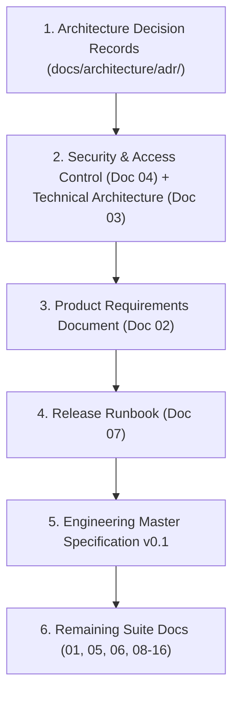

# VaultX 2.0 Architectural Baseline & Consistency Reconciliation

**Document Reference**: `docs/architecture/CONSISTENCY.md`  
**Status**: Authoritative Architectural Baseline  
**Governing ADR**: [ADR-001](file:///c:/New%20Volume%20%28D%29/ValutX%202.0/docs/architecture/adr/ADR-001-naming-and-document-hierarchy.md)  
**Input Sources**: `docs/source/` (16-doc suite, Engineering Master Specification v0.1, `valutx-engineering-manifest.json`)  
**Date**: October 2026

---

## 1. Executive Summary & Purpose

This document provides the definitive reconciliation of all architectural specifications, requirements, interfaces, and operational plans for **VaultX 2.0** (`valutx`). 

The baseline documents located in `docs/source/` represent two coordinated documentation efforts created during initial system definition:
1. The **16-Document Master Documentation Suite** (`01_Project_Brief_Scope.docx` through `16_Developer_API.docx`, plus `VALUTX_2_0_Master_Documentation_Suite.docx`).
2. The **Engineering Master Specification v0.1** (`VALUTX_2_0_Engineering_Master_Specification.docx` and `valutx-engineering-manifest.json`).

Per the non-negotiable rules in [AGENTS.md](file:///c:/New%20Volume%20%28D%29/ValutX%202.0/AGENTS.md), source documents in `docs/source/` are **frozen read-only inputs** and must not be altered directly. All architectural conflicts, lexical discrepancies, schema differences, and roadmap divergences are identified, cataloged, and resolved within this document and tracked via Architectural Decision Records (ADRs).

---

## 2. Order of Precedence & Hierarchy of Truth

When any discrepancy arises across the documentation repository, the following hierarchy strictly governs:



1. **ADRs (`docs/architecture/adr/`)**: Final binding engineering and architectural decisions.
2. **Security & Access Control (Doc 04) & Technical Architecture (Doc 03)**: Core implementation, security, and isolation constraints.
3. **Product Requirements Document (Doc 02)**: Definitive product and user-facing behavior.
4. **Release Runbook (Doc 07)**: Operational release, packaging, and deployment procedures.
5. **Engineering Master Specification v0.1**: Engineering baseline, subsystem topologies, schema models, and technical specifications.
6. **Other Suite Documents (01, 05, 06, 08–16)**: Domain-specific reference material.
7. **If sources conflict beyond this hierarchy**: Stop and request user clarification immediately.

---

## 3. Mandatory Non-Negotiable Invariants

Regardless of any draft proposals in individual suite documents, the following runtime invariants override all other text:

1. **Runtime Authority**: The AI model is an untrusted decision component; the Rust runtime is the sole authority. No model output may grant itself permission, expand scope, access raw secrets, bypass the sandbox, or touch host resources directly.
2. **Continuous Policy Evaluation**: Every privileged action carries user, project, task, and capability context. Policy is evaluated before execution and re-evaluated at execution time.
3. **Fail-Closed Execution**: If policy engine, sandbox adapter, or audit logging is unavailable, action is refused. No unsandboxed fallback or bypass mode exists.
4. **Explicit Security Scope**: Cybersecurity operations require an explicit, cryptographically verifiable `SecurityScope` enforced at network and process layers. Public-internet offensive operations are strictly prohibited.
5. **Brokered Secrets**: Secrets are brokered by reference and masked across prompts, logs, traces, and codebases.
6. **Untrusted Data Boundary**: Repositories, tool outputs, MCP payloads, plugin manifests, and agent memories are untrusted data.
7. **Verifiable & Reversible Changes**: Tasks require verifiable evidence; file changes must be checkpointed and reversible without agent self-repair.
8. **Strict Local-First Mode**: Local-only execution never silently falls back to external cloud APIs.
9. **Tamper-Evident Audit Trail**: Audit records are generated server-side, hash-chained, and signed with keys inaccessible to the agent.
10. **No Python in MVP Runtime**: Runtime/security crates are written in Rust; agent orchestrator services and UI are written in strict TypeScript. Python is excluded from MVP binaries.

---

## 4. Reconciliation of Known Suspected Conflicts

### Conflict 1: Roadmap Ordering & Sprint Breakdown

- **Where Found**:
  - `06_Feature_Backlog_Sprints.docx` (§2–§12): Outlines an 11-sprint roadmap (Sprint 0 to Sprint 10).
  - `VALUTX_2_0_Engineering_Master_Specification.docx` (§40): Outlines a 20-sprint engineering roadmap (Sprint 0 to Sprint 19).
  - `valutx-engineering-manifest.json`: Specifies `"roadmap_sprints": 20`.
- **The Issue**:
  - In `06_Feature_Backlog_Sprints.docx`, Sprint 2 is "Agent Runtime" and Sprint 3 is "Policy & Sandbox". Developing an agent runtime that completes coding tasks *prior* to establishing policy enforcement and sandboxing violates Invariants 1 and 3 (fail closed, runtime authority).
  - The 11-sprint roadmap also condenses critical security subsystems (combining isolation, process supervision, and approvals into a single sprint; deferring CLI parity to an unspecified phase).
  - The Spec §40 roadmap structures 20 disciplined sprints where threat modeling, workspace foundations, terminal safety, agent protocol, policy engine, sandboxing, and verification are established before advanced multi-agent and cyber workflows.
- **Options**:
  - *Option A*: Follow Doc 06's 11-sprint roadmap.
  - *Option B*: Follow Master Spec §40's 20-sprint roadmap.
- **Recommended Resolution (Approved)**:
  - **Adopt Option B (Spec §40 20-sprint roadmap)** as the canonical engineering baseline. 
  - The sequence ensures that the Policy Engine (Sprint 4) and Sandbox / Process Supervisor (Sprint 5) are active before unconstrained agent execution, verification, and external tool integration are permitted.

| Sprint | Canonical Deliverables (Spec §40) | Exit Gate Criteria |
|---|---|---|
| **0** | Threat model, schemas, repo scaffold, CI/CD | Architecture & schemas approved |
| **1** | Desktop shell + workspace explorer | Safe repo inspection & editing without agent |
| **2** | Git worktrees + supervised terminal shell | Safe local engineering workflow |
| **3** | Agent protocol + orchestrator state machine | Bounded task execution against protocol |
| **4** | Policy engine + human approval dialogs | Zero privileged action bypass |
| **5** | Sandbox adapter + process supervisor | Sandbox isolation conformance tests pass |
| **6** | Verification engine + Git checkpoints | Automated verification & rollback demonstrated |
| **7** | Local model adapter + offline RAG indexing | Core coding workflow operates fully offline |
| **8** | Tool registry + Tool Passport validation | Governed tools with capability manifests |
| **9** | Isolated Kali lab + Security Scope Lock | Authorized lab security workflow within CIDR |
| **10** | Evidence bundle builder + security findings | Reproducible security finding with evidence |
| **11** | Agent Firewall (network/process/secret egress) | Egress filtering & secret leak blocks verified |
| **12** | Threat model visualizer + attack/defense graph | Integrated security intelligence center |
| **13** | Plugin & MCP security gateway | Malicious MCP poisoning & confused-deputy tests pass |
| **14** | Subagent task graph & permission isolation | Inter-agent privilege escalation prevented |
| **15** | Headless CLI parity | Identical policy enforcement between CLI & desktop |
| **16** | Cloud control plane (multi-tenant auth & sync) | Remote policy & team audit synchronization |
| **17** | Background worker system | Ephemeral, isolated asynchronous jobs |
| **18** | Adversarial beta testing | Security benchmark gate & penetration test pass |
| **19** | Release hardening & signed packaging | Authenticated production release candidate |

---

### Conflict 2: Capability & Permission Vocabulary

- **Where Found**:
  - `04_Security_Access_Control.docx` (§6): Lists `repository.read`, `repository.write`, `terminal.execute`, `network.connect`, `secrets.use`, `cyber.scan`, `plugin.install`, `deploy.execute`.
  - `VALUTX_2_0_Engineering_Master_Specification.docx` (§8): Lists `project.read`, `project.write`, `terminal.execute`, `network.external`, `cyber.active_scan`, `secrets.use`, `plugin.install`, `policy.edit`, `audit.export`, `background_agent`.
  - `VALUTX_2_0_Engineering_Master_Specification.docx` (Appendix B): Uses `cyber.scan`.
  - `16_Developer_API.docx` (§2): Lists broad runtime domains (`projects`, `files`, `git`, `agent`, `plans`, `tools`, `policy`, `sandbox`, `evidence`, `audit`, `security`).
- **The Issue**:
  - Inconsistency in naming scope (`project.*` vs `repository.*`).
  - Ambiguity regarding network actions (`network.connect` vs `network.external` vs lab network).
  - Lack of distinction between passive security scanning and intrusive cybersecurity exploitation (`cyber.scan` vs `cyber.active_scan`).
  - Missing administrative and checkpoint capabilities required by runtime APIs.
- **Options**:
  - *Option A*: Retain the minimal Doc 04 list (`repository.*`, `network.connect`, `deploy.execute`).
  - *Option B*: Use Spec §8 as-is without passive scanning or deployment actions.
  - *Option C*: Synthesize a single canonical, hierarchical capability taxonomy covering all runtime domains, risk levels, and security constraints.
- **Recommended Resolution (Approved)**:
  - **Adopt Option C**. Establish a single canonical capability taxonomy formatted as `<domain>.<action>` with explicit risk classes:

| Canonical Capability | Description | Default Risk Class | Minimum Role Required | Requires Scope / Approval |
|---|---|---|---|---|
| `project.read` | Inspect files, directory tree, Git metadata | L0 | Viewer | No (Allowed) |
| `project.write` | Create, modify, delete project files | L1 | Student / Developer | Sandbox / Approval if untrusted |
| `terminal.execute` | Execute command in supervised sandbox | L2 | Student / Developer | Sandbox mandatory |
| `process.spawn` | Spawn subprocess via `process-supervisor` | L2 | Developer | Sandbox mandatory |
| `network.external` | Egress traffic to public internet | L3 | Developer (Policy) | Strict domain allowlist |
| `network.lab` | Egress traffic to isolated cyber range | L2 | Security Analyst | `SecurityScope` enforced |
| `cyber.scan` | Passive recon, port scanning, banner grabbing | L2 | Security Analyst | `SecurityScope` required |
| `cyber.active_scan`| Active vulnerability exploitation, fuzzing | L4 | Security Analyst | `SecurityScope` + Human Approval |
| `secrets.use` | Request brokered secret injection | L3 | Developer / Analyst | Approval + Policy |
| `plugin.install` | Register MCP server or plugin tool | L3 | Developer / Admin | Manifest review + Approval |
| `policy.edit` | Modify authorization rules or risk policies | L5 | Admin / Owner | MFA / Step-up auth |
| `audit.export` | Export signed tamper-evident audit logs | L1 / L3 | Auditor / Admin | Scoped to role |
| `checkpoint.restore`| Roll back workspace to historical state | L2 | Developer / Admin | User confirmation |
| `background_agent`| Spawn asynchronous autonomous subagent | L3 | Developer / Analyst | Policy quota enforced |
| `deploy.execute` | Trigger production build or external deployment | L4 | Admin / Owner | Explicit human approval |

*Rule*: All code schemas, policy rules, and Tool Passports MUST use these canonical names. The legacy string `repository.read` is strictly an alias mapped to `project.read`.

---

### Conflict 3: API Paths & Route Conventions

- **Where Found**:
  - `16_Developer_API.docx` (§3): Lists `POST /v1/agents/runs`.
  - `VALUTX_2_0_Engineering_Master_Specification.docx` (§18): Lists `POST /v1/agent-runs`, `GET /v1/agent-runs/{id}`, `POST /v1/agent-runs/{id}/cancel`, `GET /v1/agent-runs/{id}/events`.
- **The Issue**:
  - RESTful API design conflict between nested plural syntax (`/v1/agents/runs`) and flat hyphenated resource collections (`/v1/agent-runs`).
- **Options**:
  - *Option A*: Adopt `/v1/agents/runs` (Doc 16).
  - *Option B*: Adopt `/v1/agent-runs` (Spec §18).
- **Recommended Resolution (Approved)**:
  - **Adopt Option B (`/v1/agent-runs`)**. Spec §18 represents the modern OpenAPI 3.1 convention where `agent-runs` is a top-level entity possessing distinct lifecycles, states, events, and checkpoint links.

#### Canonical Core API Routes:
- `POST /v1/projects` — Create workspace project
- `GET /v1/projects/{id}` — Retrieve project metadata & trust state
- `POST /v1/projects/{id}/trust` — Escalate trust level (Restricted to Trusted)
- `POST /v1/agent-runs` — Create and initialize agent execution task
- `GET /v1/agent-runs/{id}` — Query execution state, logs, and progress
- `POST /v1/agent-runs/{id}/cancel` — Terminate run and kill child processes
- `GET /v1/agent-runs/{id}/events` — Server-Sent Events (SSE) telemetry stream
- `POST /v1/actions/{id}/approve` — Authorize pending privileged action
- `POST /v1/actions/{id}/deny` — Reject pending action and trigger replan
- `POST /v1/policy/evaluate` — Internal policy evaluation endpoint (runtime-only)
- `GET /v1/tools` — List registered and validated Tool Passports
- `POST /v1/tools/{id}/execute` — Request tool execution via sandbox
- `POST /v1/security/scopes` — Provision authorized cybersecurity target envelope
- `GET /v1/security/findings` — Retrieve structured vulnerability findings
- `POST /v1/checkpoints/{id}/restore` — Revert repository to previous checkpoint
- `GET /v1/audit/events` — Query cryptographically verified audit records

---

### Conflict 4: Role Sets & Permission Matrix Alignment

- **Where Found**:
  - `04_Security_Access_Control.docx` (§5): Outlines 9 suggested roles: `Owner`, `Admin`, `Security Admin`, `Developer`, `Security Analyst`, `Researcher`, `Student`, `Viewer`, `Auditor`.
  - `valutx-engineering-manifest.json`: Explicitly locks `"initial_roles"` to the exact 9 roles above.
  - `VALUTX_2_0_Engineering_Master_Specification.docx` (§8): Capability Matrix table only includes 5 roles: `Viewer`, `Student`, `Developer`, `Security Analyst`, `Admin`.
- **The Issue**:
  - Spec §8 omits `Owner`, `Security Admin`, `Researcher`, and `Auditor` from the concrete permission matrix, creating an implementation gap for governance, compliance auditing, research workflows, and tenant ownership.
- **Options**:
  - *Option A*: Reduce system roles to the 5 listed in Spec §8.
  - *Option B*: Standardize on the 9 roles defined in the Manifest and Doc 04, and complete the permission matrix for all 9 roles.
- **Recommended Resolution (Approved)**:
  - **Adopt Option B**. The 9-role set is canonical. Below is the completed, unified 9-role Capability & Permission Matrix:

| Capability | Viewer | Student | Researcher | Developer | Security Analyst | Security Admin | Admin | Auditor | Owner |
|---|---|---|---|---|---|---|---|---|---|
| `project.read` | Allow | Allow | Allow | Allow | Allow | Allow | Allow | Scoped | Allow |
| `project.write` | Deny | Sandbox | Sandbox | Allow | Allow | Allow | Allow | Deny | Allow |
| `terminal.execute` | Deny | Sandbox | Sandbox | Sandbox | Sandbox | Sandbox | Policy | Deny | Policy |
| `process.spawn` | Deny | Deny | Sandbox | Sandbox | Sandbox | Sandbox | Policy | Deny | Policy |
| `network.external` | Deny | Deny | Policy | Policy | Scoped | Policy | Policy | Deny | Policy |
| `network.lab` | Deny | Lab only | Lab only | Lab/scoped| Scoped | Scoped | Policy | Deny | Policy |
| `cyber.scan` | Deny | Lab only | Lab only | Lab/scoped| Scoped | Scoped | Policy | Deny | Policy |
| `cyber.active_scan`| Deny | Deny | Lab only | Deny | Scoped | Scoped | Policy | Deny | Policy |
| `secrets.use` | Deny | Deny | Scoped | Scoped | Scoped | Scoped | Scoped | Deny | Scoped |
| `plugin.install` | Deny | Deny | Approval | Approval | Approval | Allow | Allow | Deny | Allow |
| `policy.edit` | Deny | Deny | Deny | Deny | Deny | Allow | Allow | Deny | Allow |
| `audit.export` | Deny | Own | Own | Own | Own | Scoped | Allow | Allow | Allow |
| `checkpoint.restore`| Deny | Own | Own | Own | Own | Allow | Allow | Deny | Allow |
| `background_agent`| Deny | Deny | Policy | Policy | Policy | Policy | Policy | Deny | Policy |
| `deploy.execute` | Deny | Deny | Deny | Approval | Deny | Approval | Allow | Deny | Allow |

---

### Conflict 5: Naming Conventions (Code Identifiers vs Product Branding)

- **Where Found**:
  - All 16 source documentation files and Master Spec write `VALUTX 2.0`.
  - The GitHub repository, PRD, and Master Context Prompt refer to `VaultX 2.0` (with code identifiers specified as `valutx`).
- **The Issue**:
  - Case inconsistency and naming dissonance across user docs, marketing, UI, package manifests, and rust crates.
- **Options**:
  - *Option A*: Rename all code identifiers to `vaultx`.
  - *Option B*: Standardize on lowercase `valutx` for code/crates and defer brand display choice.
- **Recommended Resolution (Approved & Recorded in ADR-001)**:
  - **Code Identifiers, Rust Crates, TypeScript Packages, Schemas, and CLI**: Strictly lowercase `valutx` (e.g., crate `valutx-runtime`, binary `valutx`, npm `@valutx/protocol`).
  - **Display / Brand Name**: Retained as `VaultX 2.0` across user interfaces, READMEs, and documentation headers, while acknowledging `VALUTX 2.0` as the draft documentation heritage.

---

## 5. Additional Discovered Conflicts & Architectural Gaps

### Conflict 6: Language Runtime Stack (Python in MVP vs No-Python Invariant)

- **Where Found**:
  - `VALUTX_2_0_Engineering_Master_Specification.docx` (§3): States "allowing higher-level agent services and UI to use TypeScript/Python."
  - `AGENTS.md` (Engineering Rules): Mandates "Rust for runtime/security crates; strict TypeScript for agent services and UI. No Python in the MVP."
- **The Resolution**:
  - **AGENTS.md invariant strictly prevails**. The MVP runtime, agent services, and client applications contain **zero Python code**. 
  - Rust is used exclusively for security crates (`crates/runtime-core`, `crates/policy-engine`, `crates/sandbox`, `crates/process-supervisor`, `crates/secret-broker`, `crates/audit`).
  - Strict TypeScript is used exclusively for desktop shell, CLI client, orchestrator coordination, and UI packages.
  - Python may only exist within inert third-party target tools inside isolated Kali Docker containers during Sprint 9+.

---

### Conflict 7: Process Execution Authority (`std::process` vs `process-supervisor`)

- **Where Found**:
  - General descriptions in `03_TAD.docx` (§3) and `15_User_Manual_KB.docx` refer to launching terminal commands and running tests.
  - `AGENTS.md` (Engineering Rules): Mandates "ALL process execution goes through `process-supervisor`. No std::process::Command (or equivalent) anywhere else."
- **The Resolution**:
  - All process execution anywhere in the repository must invoke the `valutx-process-supervisor` crate. 
  - Direct invocations of `std::process::Command` in Rust or `child_process.spawn` in TypeScript are prohibited and will be rejected by CI lint rules.

---

### Conflict 8: Structured Error Codes Across User Boundaries

- **Where Found**:
  - `16_Developer_API.docx` (§7): Generic HTTP status codes (400, 401, 403, 500).
  - `AGENTS.md` (Engineering Rules): Mandates stable structured machine codes across boundaries without raw stack traces.
- **The Resolution**:
  - All API, IPC, and CLI errors MUST adhere to the canonical schema:
    ```json
    {
      "error": {
        "code": "POLICY_DENIED",
        "message": "Human-readable explanation",
        "details": {},
        "action_id": "uuid",
        "remediation": "Request approval from project admin"
      }
    }
    ```
  - Standard error codes locked for MVP:
    - `POLICY_DENIED`: Operation rejected by active policy rule.
    - `SCOPE_DENIED`: Target outside authorized `SecurityScope`.
    - `SANDBOX_UNAVAILABLE`: Isolation runtime failed or uninitialized.
    - `TOOL_NOT_FOUND`: Tool Passport missing or unregistered.
    - `APPROVAL_REQUIRED`: Action paused awaiting human signature.
    - `VERIFICATION_FAILED`: Pre/post checks failed; action rolled back.
    - `RESOURCE_LIMIT`: CPU, memory, timeout, or rate quota exceeded.

---

### Conflict 9: Monorepo Directory Architecture

- **Where Found**:
  - Spec §3 outlines a monorepo structure.
  - Initial workspace had only root files.
- **The Resolution**:
  - Standardize on the canonical monorepo layout specified in Spec §3:

```text
valutx/
├── apps/
│   ├── desktop/          # Tauri desktop client (Rust + React/TS)
│   ├── cli/              # Headless developer CLI (TypeScript/Node)
│   └── docs/             # Architecture & developer documentation site
├── crates/
│   ├── runtime-core/     # Lifecycle state machine & coordinator
│   ├── policy-engine/    # Rego/OPA-inspired capability policy evaluator
│   ├── sandbox/          # OS-specific container/namespace isolation adapter
│   ├── process-supervisor/# Hardened process spawn & monitor
│   ├── secret-broker/    # Ephemeral token injection & redaction
│   ├── audit/            # Hash-chained signed event logger
│   ├── git-service/      # Safe worktree & checkpoint manager
│   └── terminal/         # Supervised pseudo-terminal manager
├── services/
│   ├── agent-orchestrator/# Task graph, planner, subagent coordinator
│   ├── context-engine/   # AST, semantic search, repo indexing
│   ├── model-router/     # Multi-provider local/cloud routing
│   ├── verification/     # Test, lint, build verifier
│   ├── tool-registry/    # Tool Passport loader & capability mapper
│   ├── evidence/         # Cryptographic evidence bundle generator
│   └── cloud-control-plane/# Optional enterprise auth & sync
├── packages/
│   ├── protocol/         # Shared IPC / event schemas
│   ├── schemas/          # Source-of-truth JSON Schemas (codegen input)
│   ├── ui/               # Reusable React UI component library
│   ├── sdk/              # TypeScript SDK for extensions
│   └── test-fixtures/    # Inert test canaries & loopback listeners
├── security/
│   ├── policies/         # Baseline Rego/JSON policies
│   ├── threat-models/    # Machine-readable STRIDE models
│   └── sandbox-profiles/ # Landlock/AppArmor/Windows JobObject profiles
└── docs/
    ├── architecture/     # ADRs, CONSISTENCY.md, threat models
    └── source/           # Immutable source baseline docx & manifest
```

---

### Conflict 10: Local-First Storage & Offline RAG Architecture

- **Where Found**:
  - Spec §17 and §42 leave local vector store and local database options open.
- **The Resolution**:
  - **Local Database**: Embedded **SQLite** in WAL mode for task history, checkpoints, approvals, audit logs, and metadata.
  - **Local Vector Store**: Embedded **LanceDB** or **SQLite-vec** (serverless, zero external daemons).
  - **Cloud Control Plane (Enterprise)**: PostgreSQL (self-hosted or Supabase compatible), used exclusively for remote policy distribution, team audit log replication, and organization RBAC.

---

## 6. Open Decisions Reserved for Product Owner

The following items are purely operational or brand decisions that do not block architectural consistency:

1. **User-Facing Brand Identity**: Confirmation whether the desktop splash screen and packaging will read **"VaultX 2.0"** or **"VALUTX 2.0"**. (Code identifiers remain `valutx`).
2. **Desktop Shell Framework**: Confirmation of **Tauri v2** (Rust core + TypeScript frontend) as the primary desktop runtime.
3. **Local Vector Engine**: Selection between **LanceDB** (high performance columnar) and **SQLite-vec** (single-file simplicity).

---

## 7. Change Log & Verification

- **2026-10-02**: Initial draft established by reconciliation agent; resolved roadmaps, capabilities, API routes, roles, naming, and engineering invariants. Verified against `AGENTS.md` and `docs/source/`.
