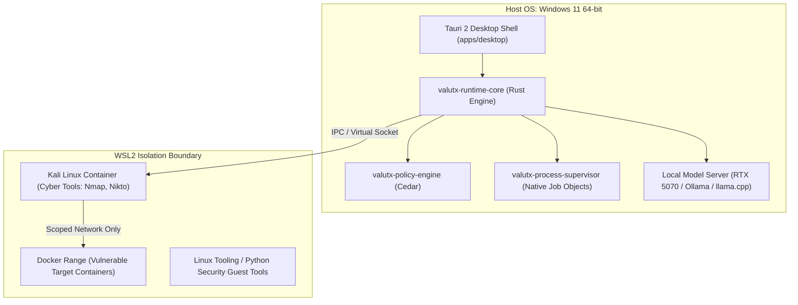

# VaultX 2.0 Host OS & Hardware Capability Matrix

**Document Reference**: `docs/architecture/OS-AND-HARDWARE-MATRIX.md`  
**Host Profile Target**: Developer Workstation Baseline  
**Evaluation Date**: October 2026  
**Governing ADRs**: [ADR-002](adr/ADR-002-tauri-2-isolation-pattern.md), [ADR-003](adr/ADR-003-os-sandboxing-and-cyber-lab.md), [ADR-005](adr/ADR-005-provider-neutral-model-adapter.md), [ADR-006](adr/ADR-006-rust-and-typescript-language-stack.md)

---

## 1. Host Machine Hardware & Environment Profile

This matrix evaluates component execution capabilities specifically on the primary developer host machine:

| Component | Detected Specification | Capability Tier | Notes |
|---|---|---|---|
| **Operating System** | Microsoft Windows 11 Home (Build 26300, 64-bit) | Tier 1 Desktop Host | Supported via Windows Job Objects + WSL2 |
| **CPU** | Intel Core Ultra 9 285H (16 Cores, 16 Threads) | High Compute (Arrow Lake) | High-speed multi-core compilation & sandboxing |
| **Physical RAM** | 32 GB LPDDR5x / DDR5 | Tier 1 (32 GB) | Full capacity for concurrent local models + IDE |
| **Discrete GPU** | NVIDIA GeForce RTX 5070 Laptop GPU | CUDA Compute (High) | Ideal for 8B–14B local model inference & GBNF |
| **Integrated GPU** | Intel Arc 140T GPU (16 GB shared) | Intel Xe / OpenVINO / oneAPI | Secondary acceleration for embeddings / RAG |
| **Virtualization** | WSL2 (Ubuntu, Kali Linux, Docker Desktop) | Active Tier 1 | Kali & Docker containers run natively in VM |
| **Docker Engine** | Docker Desktop v29.8.0 | Active | Cyber range lab execution ready |

---

## 2. Component Execution Matrix: What Runs Where



| Subsystem / Component | Execution Target | Mechanism | Performance / Security Profile |
|---|---|---|---|
| **Desktop UI (`apps/desktop`)** | Host Windows 11 | Tauri 2 Webview (Edge WebView2) | Hardware accelerated; strict CSP; isolation iframe. |
| **Runtime Core (`crates/runtime-core`)** | Host Windows 11 | Native Rust Binary (`valutx`) | Sub-millisecond latency; direct memory safety. |
| **Policy Engine (`crates/policy-engine`)** | Host Windows 11 | Native Cedar in Rust | <50μs evaluation; zero external network dependencies. |
| **Local Dev Sandboxing** | Host Windows 11 | Windows Job Objects + Restricted Tokens | Native NTFS performance; memory/CPU hard quotas. |
| **Local Offline LLM** | Host Windows 11 (GPU) | NVIDIA RTX 5070 (CUDA) | 8B/14B Q4_K_M models run at >60 tokens/sec. |
| **Local Embeddings (RAG)** | Host Windows 11 | Intel Arc 140T or RTX 5070 | Sub-10ms batch embedding generation. |
| **Offensive Cyber Tools (Kali)** | WSL2 (`kali-linux`) / Docker | Ephemeral container with restricted vEthernet | Raw sockets, packet inspection; isolated from Windows host. |
| **Vulnerable Range Targets** | WSL2 Docker Engine | Isolated virtual bridge network | Resettable, loopback/private CIDR only. |

---

## 3. Known Gaps, Limitations & Technical Challenges

### Gap 1: Cross-Filesystem I/O Latency (Windows vs WSL2 9P Boundary)
- **Problem**: If the local repository is stored on `C:\...` (NTFS) and a tool running inside WSL2 attempts to read it across the `/mnt/c` mount, file read performance is up to 5x slower due to 9P translation.
- **Mitigation**:
  - Keep standard software engineering tasks running natively on Windows via Windows Job Objects.
  - When running security scans against the repo from Kali WSL2, copy target files into an ephemeral Linux tar archive or dedicated workspace volume.

### Gap 2: Windows Home Edition Hyper-V Constraints
- **Problem**: Windows 11 Home lacks full Windows Sandbox / Hyper-V Manager GUI, though WSL2 and Docker Desktop operate normally via Virtual Machine Platform.
- **Mitigation**: Rely on WSL2 backend for containerized isolation rather than native Hyper-V microVMs on this specific workstation.

### Gap 3: Multi-GPU Selection Ambiguity
- **Problem**: System possesses both Intel Arc 140T and NVIDIA RTX 5070. Without explicit device selection, Ollama or llama.cpp may bind to the integrated Intel GPU rather than the faster NVIDIA discrete GPU.
- **Mitigation**: Configure `CUDA_VISIBLE_DEVICES=0` and device ID selection in `services/model-router` to guarantee inference routes to the RTX 5070, reserving the Intel Arc GPU for background embedding generation.

---

## 4. Hardware Verification Checklist

```powershell
# Verify NVIDIA GPU availability
nvidia-smi

# Verify WSL2 Kali instance status
wsl.exe -l -v

# Verify Docker engine connectivity
docker info
```
